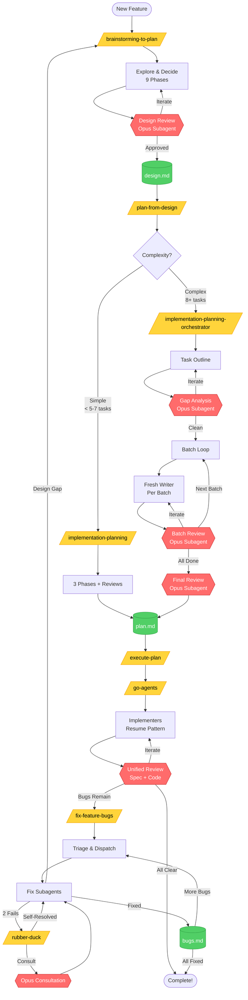

# Custom Claude Code Skills

A collection of custom skills for Claude Code that improve the planning, implementation, and bug-fixing workflow.

## Skills Included

### `brainstorming-to-plan`
Explore requirements and design before implementation. Use when starting any feature work to clarify goals, explore options, and make decisions. Includes adversarial design review to catch gaps before planning.

**Flow:**
1. Understand the goal (problem, success criteria, constraints)
2. Explore solution space (2-3 options with pros/cons)
3. Make decisions (explicit choices with rationale)
4. Define scope (must have / nice to have / out of scope)
5. Write Gherkin user stories (for user-facing features)
6. Write initial design document
7. **Adversarial design review** (Opus subagent challenges the design)
8. Incorporate feedback & iterate
9. Hand off to `implementation-planning`

**Output:** `docs/<feature-name>/design.md`

**Use:** `/brainstorming-to-plan`

### `implementation-planning-orchestrator` (Recommended)
Multi-agent orchestrated implementation planning with batched writing and incremental reviews. Handles plans of any size without context limits.

**The Orchestration Flow:**
1. **Task Outline** - Single agent creates high-level structure
2. **Gap Analysis** - Opus subagent finds structural gaps, iterate until clean
3. **Batched Detailed Planning** - Fresh agents write 5-8 tasks per batch
4. **Incremental Reviews** - Each batch reviewed before next begins
5. **Final Holistic Review** - Opus subagent validates entire plan
6. **Feedback Incorporation** - Address any final issues

**Key innovation:** Plans written in batches by fresh agents with incremental reviews. Scales to any plan size while maintaining quality.

**Output:** `docs/<feature-name>/plan.md`

**Use for:** 8+ tasks, complex features, production work
**Use:** `/implementation-planning-orchestrator` (auto-invoked by `/plan-from-design`)

### `implementation-planning`
Single-agent implementation planning for simple, straightforward plans (< 5-7 tasks).

**The Three-Phase Approach:**
1. **Phase 1: Task Outline** - Goals, inputs, outputs, dependencies
2. **Phase 2: Gap Analysis** - Opus subagent reviews, iterate if needed
3. **Phase 3: Detailed Plan** - Write complete implementation in one pass
4. **Phase 4: Final Review** - Opus subagent verifies executability

**Output:** `docs/<feature-name>/plan.md`

**Use for:** Simple plans with few straightforward tasks
**Use:** `/implementation-planning`

**When in doubt, use orchestrator** - it handles any complexity gracefully.

### `go-agents`
Execute implementation plans with resumable subagents, agent-to-agent communication via resume, and batched reviews.

**Key features:**
- Resume agents for questions (true agent-to-agent communication)
- Reuse agents while context allows (efficient)
- Batch reviews after agent exhaustion (not per-task)
- Unified reviewer (spec + code quality combined)

**Use:** `/execute-plan <path-to-plan>`

### `fix-feature-bugs`
Orchestrates bug fixing after plan execution. Bootstraps from feature docs, triages bugs, dispatches fix subagents with full context, and handles escalation.

**The Flow:**
1. **Bootstrap** - Read design.md, bugs.md; search plan.md for relevant sections
2. **Triage** - Categorize bugs, group related ones, gather code sites
3. **Dispatch** - Subagent per bug group with full context
4. **Handle Returns** - Fixed, rubber-duck, or design gap
5. **Collect** - Update bugs.md, verify fixes

**Output:** Updated `docs/<feature-name>/bugs.md`

**Use:** `/fix-feature-bugs <feature-dir> <bug descriptions>`

### `rubber-duck`
Structured prompt-writing for stuck bugs. When you can't figure out why something isn't working, writing a detailed explanation often reveals the answer.

**Core principle:** Writing the explanation IS the debugging. The prompt is a side effect.

**When to invoke:**
- After 2 failed fix attempts
- When uncertain ("I'm not sure why...")
- Explicit request

**The Process:**
1. Write detailed prompt explaining the bug to "another LLM"
2. Pause - often self-resolves during writing
3. If stuck: offer consultation (external LLM or Opus agent)
4. If still stuck: escalate to systematic-debugging

**Use:** Automatically invoked by `fix-feature-bugs` subagents, or manually

---

## The Escalation Ladder

When bugs resist fixing, escalate methodically:

```
Direct Fix (subagent attempts)
     │
     ▼ (2 fails OR uncertainty)
Rubber-Duck (write explanation prompt)
     │
     ├─► Self-resolved → apply fix → done
     │
     ▼ (still stuck)
Consultation (external LLM or Opus agent)
     │
     ├─► Resolved → apply fix → done
     │
     ▼ (still stuck)
Systematic Debugging (full 4-phase investigation)
     │
     ├─► Root cause found → fix → done
     │
     ▼ (reveals architectural issue)
Brainstorm-to-Design (design gap)
```

---

## Installation

```bash
# Clone or navigate to this repo
cd ~/projects/claude-custom-skills

# Preview what will be installed
./install.sh --dry-run

# Install skills, prompts, and commands
./install.sh
```

## Uninstallation

```bash
# Preview what will be removed
./uninstall.sh --dry-run

# Remove skills
./uninstall.sh
```

## Workflow Diagram



**Legend:** Yellow = Commands/Skills | Red = Reviews (Opus) | Green = Documents

For detailed workflow, see [workflow-diagram.md](workflow-diagram.md)

---

## Text Workflow

For new features or complex tasks:

```
/brainstorming-to-plan              # Explore and decide (includes design review)
        ↓                           # Output: docs/<feature>/design.md
/plan-from-design <design-doc>      # Create implementation plan from design
        ↓                           # Output: docs/<feature>/plan.md
/execute-plan <plan-file>           # Coordinated execution with subagents
        ↓
/fix-feature-bugs <feature> <bugs>  # Fix remaining bugs (if any)
                                    # Output: docs/<feature>/bugs.md
```

For well-defined tasks where you know the approach:

```
/implementation-planning            # Plan with gap analysis
        ↓
/execute-plan <plan-file>           # Coordinated execution with subagents
```

---

## Feature Docs Convention

All feature artifacts live together in `docs/<feature-name>/`:

```
docs/
└── <feature-name>/
    ├── design.md      # From brainstorming-to-plan
    │                  # Architecture, decisions, trade-offs
    │
    ├── plan.md        # From implementation-planning
    │                  # Tasks, code locations, integration points
    │
    ├── bugs.md        # Living document (from fix-feature-bugs)
    │                  # Found, fixed, remaining, discoveries
    │
    └── ...            # Other artifacts as needed
```

**Naming:** Use kebab-case, match branch name when possible
**Examples:** `user-auth`, `metrics-export`, `dark-mode-toggle`

---

## Commands Included

### `/plan-from-design <path>`
Create an implementation plan from a design document.

**Usage:** `/plan-from-design docs/user-auth/design.md`

This command loads your design document and invokes `implementation-planning`, which will:
- Create a task outline based on your design
- Run gap analysis with Opus subagent
- Write the detailed implementation plan
- Run final plan review with Opus subagent
- Output the `/execute-plan` command to run it

### `/execute-plan <path>`
Execute an implementation plan using coordinated subagent orchestration.

**Usage:** `/execute-plan docs/user-auth/plan.md`

This command loads the plan and invokes `go-agents`, which:
- Extracts tasks from the plan
- Dispatches implementer subagents
- Resumes agents for questions and additional tasks
- Batch reviews when agents exhaust context
- Completes with finishing-a-development-branch

### `/fix-feature-bugs <feature-dir> <bugs>`
Fix bugs remaining after plan execution.

**Usage:** `/fix-feature-bugs user-auth "Login fails silently; Password reset not sent"`

This command bootstraps from feature docs and:
- Reads design.md and bugs.md fully
- Searches plan.md for relevant sections
- Triages and groups bugs
- Dispatches fix subagents with full context
- Handles escalation (rubber-duck, consultation, design gap)
- Updates bugs.md with results

---

## File Structure

```
claude-custom-skills/
├── README.md
├── install.sh                                    # Install skills, prompts, and commands
├── uninstall.sh                                  # Remove installed files
├── skills/
│   ├── brainstorming-to-plan/
│   │   ├── SKILL.md                              # Main skill
│   │   └── design-review.md                      # Design review prompt
│   ├── implementation-planning/                  # Simple plans (< 5-7 tasks)
│   │   ├── SKILL.md                              # Main skill
│   │   ├── gap-analysis-review.md                # Gap analysis prompt
│   │   └── plan-review.md                        # Final review prompt
│   ├── implementation-planning-orchestrator/     # Complex plans (8+ tasks) - Recommended
│   │   ├── SKILL.md                              # Orchestrator skill
│   │   ├── gap-analysis-review.md                # Gap analysis prompt
│   │   ├── batch-plan-writer.md                  # Batch writing prompt
│   │   ├── batch-plan-reviewer.md                # Batch review prompt
│   │   └── plan-review.md                        # Final review prompt
│   ├── go-agents/                                # Execution coordination
│   │   ├── SKILL.md
│   │   ├── implementer-prompt.md
│   │   └── unified-reviewer-prompt.md
│   ├── fix-feature-bugs/                         # Post-implementation bug fixing
│   │   ├── SKILL.md
│   │   └── bug-fixer-prompt.md                   # Subagent dispatch template
│   └── rubber-duck/                              # Stuck bug escalation
│       ├── SKILL.md
│       └── opus-consultation-prompt.md           # Fresh perspective analysis
├── prompts/                                      # Shared prompts
│   ├── design-review.md
│   ├── gap-analysis-review.md
│   ├── batch-plan-writer.md
│   ├── batch-plan-reviewer.md
│   └── plan-review.md
└── commands/
    ├── plan-from-design.md                       # Create plan from design doc
    ├── execute-plan.md                           # Execute plan with subagents
    └── fix-feature-bugs.md                       # Fix post-implementation bugs
```

The install script copies:
- Skills → `~/.claude/skills/`
- Prompts → `~/.claude/prompts/`
- Commands → `~/.claude/commands/`

## Adding New Skills

1. Create a new directory in `skills/` with a `SKILL.md` file
2. Follow the skill format with YAML frontmatter:
   ```yaml
   ---
   name: my-skill
   description: What this skill does
   model: claude-opus-4-5-20251101  # optional
   ---
   ```
3. Add supporting prompts in the same directory
4. Run `./install.sh` to deploy

## Why These Skills?

The default planning approach often produces plans with gaps - missing integration points, tasks that don't connect, incomplete wiring, or unclear instructions. Even worse, agents hit context limits on complex plans and resort to placeholders. These skills solve both problems:

### Multi-Layered Adversarial Review
1. **Design review (brainstorming)** - Fresh Opus subagent challenges designs before planning
2. **Gap analysis (planning)** - Fresh Opus subagent finds structural gaps in task outlines
3. **Incremental batch reviews** - Each batch of tasks reviewed before next begins
4. **Final plan review** - Fresh Opus subagent verifies complete executability
5. **Using Opus for all reviews** - Better reasoning for catching subtle gaps

### Scalable Planning Architecture
6. **Batched planning** - Plans written in 5-8 task batches by fresh agents
7. **No context limits** - Each batch agent starts fresh with room for review feedback
8. **Incremental quality** - Issues caught and fixed per batch, not at the end
9. **Resumable agents** - Writers can incorporate feedback via resume, not restart

### Complete Workflow
10. **Separating exploration from planning** - Brainstorm with Gherkin scenarios first
11. **Iterating at each stage** - Fix issues before moving to next phase
12. **Subagent-driven execution** - Coordinated implementation with dependency management
13. **Structured bug fixing** - Post-implementation bugs handled with context and escalation

### Smart Bug Fixing
14. **Context bootstrapping** - Fresh sessions start with full feature context from docs
15. **Escalation ladder** - Direct fix → Rubber-duck → Consultation → Systematic debugging
16. **Design gap detection** - Bugs that reveal missing design escalate to brainstorming
17. **Rubber-duck debugging** - Writing the explanation often reveals the solution

**Result:** Gap-free, complete plans at any scale with no placeholders or context-limit compromises, plus structured bug fixing when implementation doesn't go perfectly.
