# Opus Says No

```
THE PROCESS IS THE SHORTCUT.
```

A collection of custom skills for Claude Code that enforce discipline in planning, implementation, and bug-fixing.

```
PLANS WITH GAPS ARE BUGS YOU HAVEN'T FOUND YET.
```

## The Philosophy

Every shortcut in planning becomes a bug in implementation. Every skipped review becomes a regression. Every "just try this" becomes three hours of debugging.

**Opus says no to:**
- Plans with placeholders ("add validation here")
- Skipping adversarial review ("it looks fine to me")
- Context-limit compromises ("I'll summarize the rest")
- Fixing bugs without understanding them ("let me try one more thing")
- Starting fresh sessions without context ("what does this feature do again?")

**Opus says yes to:**
- Gap analysis before detailed planning
- Fresh Opus subagents challenging every design
- Batched planning that scales to any size
- Structured escalation when bugs resist fixing
- Feature docs that transfer context between sessions

---

## Skills Included

### `dream-first`

Don't start coding until you know what you're building.

**Core principle:** Exploration before commitment. Decisions before details.

1. Understand the goal (problem, success criteria, constraints)
2. Explore 2-3 approaches with trade-offs
3. Make explicit decisions with rationale
4. Define scope ruthlessly (must have / nice to have / out of scope)
5. Write Gherkin scenarios (for user-facing features)
6. Write design document
7. **Adversarial review** - Fresh Opus challenges everything
8. Iterate until approved
9. Hand off to planning

**Output:** `docs/<feature-name>/design.md`

### `blueprint-maestro` (Recommended)

The conductor for complex plans.

**Core principle:** Fresh agents per batch. Reviews before next batch. No compromises.

```
BATCH SIZE MATTERS. TOO LARGE = PLACEHOLDERS. TOO SMALL = OVERHEAD.
```

1. **Task Outline** - Goals and connections, not code
2. **Gap Analysis** - Opus finds what you missed
3. **Batched Planning** - 5-8 tasks per fresh agent
4. **Incremental Reviews** - Each batch approved before next
5. **Final Review** - End-to-end validation

**Use for:** 8+ tasks, complex features, anything that matters

**Output:** `docs/<feature-name>/plan.md`

### `blueprint`

Draw the plan before you build.

Same rigor, single agent. Use when you have < 5-7 straightforward tasks.

### `go-time`

Time to make it real.

**Core principle:** Resume > re-dispatch. Context is expensive.

- Agents answer questions via resume (true agent-to-agent communication)
- Agents continue with next task while context allows
- Batch review after agent exhaustion, not per-task
- Unified reviewer checks spec AND quality in one pass

### `patch-party`

Implementation rarely ends clean. Time to clean up.

**Core principle:** Context is expensive. Transfer it, don't rebuild it.

```
IMPLEMENTATION COMPLETE ≠ FEATURE COMPLETE
```

1. **Bootstrap** - Read design.md and bugs.md fully, search plan.md
2. **Triage** - Categorize, group related bugs, gather code sites
3. **Dispatch** - Subagent per bug group with full context
4. **Handle Returns** - Fixed, rubber-duck, or design gap
5. **Collect** - Update bugs.md, verify all fixes

**Output:** `docs/<feature-name>/bugs.md`

### `rubber-duck`

When you can't figure out why something isn't working, explain it to someone else. Half the time, you'll solve it mid-sentence.

**Core principle:** Writing the explanation IS the debugging. The prompt is a side effect.

```
IF YOU CAN'T EXPLAIN IT CLEARLY, YOU DON'T UNDERSTAND IT YET
```

**Triggers:**
- 2 failed fix attempts
- "I'm not sure why this isn't working"
- Explicit request

**Process:**
1. Write detailed prompt explaining the bug
2. Pause - did writing reveal the answer?
3. If still stuck: consult external LLM or Opus agent
4. If still stuck: escalate to systematic-debugging

---

## The Escalation Ladder

```
ESCALATE ON EVIDENCE, NOT FRUSTRATION
```

When bugs resist fixing, escalate methodically:

```
Direct Fix (subagent attempts)
     │
     ▼ (2 fails OR uncertainty)
Rubber-Duck (write explanation prompt)
     │
     ├─► Self-resolved → done
     │
     ▼ (still stuck)
Consultation (external LLM or Opus agent)
     │
     ├─► Resolved → done
     │
     ▼ (still stuck)
Systematic Debugging (full 4-phase investigation)
     │
     ├─► Root cause found → done
     │
     ▼ (reveals architectural issue)
Dream-First (it's not a bug, it's a design gap)
```

---

## What Opus Says No To

| Shortcut | Why It Fails | What To Do Instead |
|----------|--------------|-------------------|
| "Skip the design review" | Gaps bake into the plan | Adversarial review catches them |
| "I'll add tests later" | You won't. And if you do, they'll be weak. | TDD or write tests with the plan |
| "Just try this fix" | Fix #3, #4, #5 are coming | Rubber-duck after 2 failures |
| "The plan looks complete" | To you. Fresh eyes see differently. | Gap analysis with Opus subagent |
| "I'll remember the context" | You won't. Next session starts cold. | Write to docs/<feature>/ |
| "One more fix attempt" | You've been saying that for an hour | Escalate. Rubber-duck or systematic. |
| "It's a simple bug" | Simple bugs that resist 2 fixes aren't simple | Follow the escalation ladder |
| "I don't need the full process" | That's what everyone thinks before wasting 3 hours | The process IS the shortcut |

---

## Quick Start

For any new feature:

```
/dream-first                 # What are we building?
/blueprint <feature>         # How are we building it?
/go-time <feature>           # Build it.
/patch-party <feature> "..."  # Fix what's left.
```

If you skip steps, Opus will punish you later.

---

## Installation

```bash
cd ~/projects/claude-custom-skills

# Preview
./install.sh --dry-run

# Install
./install.sh
```

## Uninstallation

```bash
./uninstall.sh --dry-run
./uninstall.sh
```

---

## The Workflow

```mermaid
flowchart TD
    Start([New Feature]) --> DreamFirst[/dream-first/]
    DreamFirst --> Explore[Explore & Decide]
    Explore --> DesignReview{{Design Review<br/>Opus Says No?}}
    DesignReview -->|Iterate| Explore
    DesignReview -->|Approved| DesignDoc[(design.md)]

    DesignDoc --> BlueprintCmd[/blueprint/]
    BlueprintCmd --> Assess{Complexity?}

    Assess -->|Simple| BlueprintSkill[blueprint skill]
    BlueprintSkill --> PlanDoc[(plan.md)]

    Assess -->|Complex| Maestro[blueprint-maestro]
    Maestro --> Outline[Task Outline]
    Outline --> GapReview{{Gap Analysis<br/>Opus Says No?}}
    GapReview -->|Iterate| Outline
    GapReview -->|Clean| BatchLoop[Batch Loop]

    BatchLoop --> Writer[Fresh Writer]
    Writer --> BatchReview{{Batch Review<br/>Opus Says No?}}
    BatchReview -->|Iterate| Writer
    BatchReview -->|Next| BatchLoop
    BatchReview -->|Done| FinalReview{{Final Review}}
    FinalReview --> PlanDoc

    PlanDoc --> GoTimeCmd[/go-time/]
    GoTimeCmd --> GoTime[go-time skill]
    GoTime --> Impl[Implementers]
    Impl --> UnifiedReview{{Unified Review}}
    UnifiedReview -->|Iterate| Impl
    UnifiedReview -->|Bugs| PatchParty[/patch-party/]
    UnifiedReview -->|Clean| Done([Complete!])

    PatchParty --> Triage[Triage]
    Triage --> FixAgent[Fix Subagents]
    FixAgent -->|2 Fails| RubberDuck[/rubber-duck/]
    RubberDuck --> FixAgent
    FixAgent -->|Design Gap| DreamFirst
    FixAgent -->|Fixed| BugsDoc[(bugs.md)]
    BugsDoc -->|More| Triage
    BugsDoc -->|Done| Done

    classDef reviewNode fill:#ff6b6b,stroke:#c92a2a,color:#fff
    classDef cmdNode fill:#ffd43b,stroke:#f59f00,color:#000
    classDef docNode fill:#51cf66,stroke:#2f9e44,color:#fff

    class DesignReview,GapReview,BatchReview,FinalReview,UnifiedReview reviewNode
    class DreamFirst,BlueprintCmd,BlueprintSkill,Maestro,GoTimeCmd,GoTime,PatchParty,RubberDuck cmdNode
    class DesignDoc,PlanDoc,BugsDoc docNode
```



**Legend:** 🟡 Skills | 🔴 Reviews (Opus Says No?) | 🟢 Documents

---

## Text Workflow

```
/dream-first                   # Explore. Decide. Review.
        ↓                      # → docs/<feature>/design.md
/blueprint <feature>           # Outline. Gap analysis. Detail. Review.
        ↓                      # → docs/<feature>/plan.md
/go-time <feature>             # Implement. Resume. Review.
        ↓
/patch-party <feature> "..."   # Bootstrap. Triage. Fix. Escalate.
                               # → docs/<feature>/bugs.md
```

---

## Feature Docs Convention

All feature artifacts live together. Fresh sessions bootstrap from here.

```
docs/
└── <feature-name>/
    ├── design.md      # Architecture, decisions, trade-offs
    ├── plan.md        # Tasks, code, integration points
    ├── bugs.md        # Found, fixed, remaining
    └── ...            # Whatever else accumulates
```

**Naming:** kebab-case, match branch name when possible

---

## Commands

### `/blueprint <feature>`

```
/blueprint user-auth
```

Creates implementation plan from `docs/<feature>/design.md` with gap analysis and review.

### `/go-time <feature>`

```
/go-time user-auth
```

Executes plan from `docs/<feature>/plan.md` with resumable subagents and batched reviews.

### `/patch-party <feature> "<bugs>"`

```
/patch-party user-auth "Login fails silently; Password reset not sent"
```

Bootstraps from feature docs, triages, dispatches fix subagents, handles escalation.

---

## File Structure

```
claude-custom-skills/
├── skills/
│   ├── dream-first/           # Explore → Design → Review
│   ├── blueprint/             # Simple plans (< 5-7 tasks)
│   ├── blueprint-maestro/     # Complex plans (8+ tasks)
│   ├── go-time/               # Resumable execution
│   ├── patch-party/           # Post-implementation bugs
│   └── rubber-duck/           # Stuck bug escalation
├── prompts/                   # Shared review prompts
├── commands/                  # Entry points
├── install.sh
└── uninstall.sh
```

---

## Why This Exists

The default approach produces plans with gaps. Agents hit context limits and leave placeholders. Reviews get skipped "just this once." Bugs get fixed with "let me try one more thing" until you've burned three hours.

**This is what Opus says no to.**

### The Multi-Layered Review System

1. **Design review** - Fresh Opus challenges designs before planning
2. **Gap analysis** - Fresh Opus finds structural gaps in outlines
3. **Batch reviews** - Each batch reviewed before next begins
4. **Final review** - Fresh Opus verifies end-to-end executability
5. **Unified code review** - Spec compliance + quality in one pass

### The Scalable Planning Architecture

- Plans written in 5-8 task batches by fresh agents
- No context limits because each batch starts fresh
- Issues caught per batch, not at the end
- Writers resume for feedback instead of restarting

### The Structured Bug Fixing

- Context bootstraps from docs/<feature>/
- Escalation ladder prevents thrashing
- Design gaps escalate to dreaming
- Rubber-duck catches what persistence misses

---

```
THE PROCESS IS THE SHORTCUT.
```
