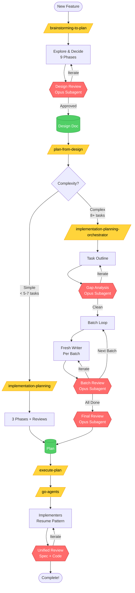

# Custom Claude Code Skills

A collection of custom skills for Claude Code that improve the planning and implementation workflow.

## Skills Included

### `brainstorming-to-plan`
Explore requirements and design before implementation. Use when starting any feature work to clarify goals, explore options, and make decisions. Includes adversarial design review to catch gaps before planning.

**Flow:**
1. Understand the goal (problem, success criteria, constraints)
2. Explore solution space (2-3 options with pros/cons)
3. Make decisions (explicit choices with rationale)
4. Define scope (must have / nice to have / out of scope)
5. Write Gherkin user stories (for user-facing features)
6. Write initial design document
7. **Adversarial design review** (Opus subagent challenges the design)
8. Incorporate feedback & iterate
9. Hand off to `implementation-planning`

**Use:** `/brainstorming-to-plan`

### `implementation-planning-orchestrator` (Recommended)
Multi-agent orchestrated implementation planning with batched writing and incremental reviews. Handles plans of any size without context limits.

**The Orchestration Flow:**
1. **Task Outline** - Single agent creates high-level structure
2. **Gap Analysis** - Opus subagent finds structural gaps, iterate until clean
3. **Batched Detailed Planning** - Fresh agents write 5-8 tasks per batch
4. **Incremental Reviews** - Each batch reviewed before next begins
5. **Final Holistic Review** - Opus subagent validates entire plan
6. **Feedback Incorporation** - Address any final issues

**Key innovation:** Plans written in batches by fresh agents with incremental reviews. Scales to any plan size while maintaining quality.

**Use for:** 8+ tasks, complex features, production work
**Use:** `/implementation-planning-orchestrator` (auto-invoked by `/plan-from-design`)

### `implementation-planning`
Single-agent implementation planning for simple, straightforward plans (< 5-7 tasks).

**The Three-Phase Approach:**
1. **Phase 1: Task Outline** - Goals, inputs, outputs, dependencies
2. **Phase 2: Gap Analysis** - Opus subagent reviews, iterate if needed
3. **Phase 3: Detailed Plan** - Write complete implementation in one pass
4. **Phase 4: Final Review** - Opus subagent verifies executability

**Use for:** Simple plans with few straightforward tasks
**Use:** `/implementation-planning`

**When in doubt, use orchestrator** - it handles any complexity gracefully.

Then execute plans with: `/execute-plan <path-to-plan>`

## Installation

```bash
# Clone or navigate to this repo
cd ~/projects/claude-custom-skills

# Preview what will be installed
./install.sh --dry-run

# Install skills, prompts, and commands
./install.sh
```

## Uninstallation

```bash
# Preview what will be removed
./uninstall.sh --dry-run

# Remove skills
./uninstall.sh
```

## Workflow Diagram



**Legend:** 🟡 Commands/Skills | 🔴 Reviews (Opus) | 🟢 Documents

For detailed workflow, see [workflow-diagram.md](workflow-diagram.md)

---

## Text Workflow

For new features or complex tasks:

```
/brainstorming-to-plan              # Explore and decide (includes design review)
        ↓
/plan-from-design <design-doc>      # Create implementation plan from design
        ↓
/execute-plan <plan-file>           # Coordinated execution with subagents
```

For well-defined tasks where you know the approach:

```
/implementation-planning            # Plan with gap analysis
        ↓
/execute-plan <plan-file>           # Coordinated execution with subagents
```

## Commands Included

### `/plan-from-design <path>`
Create an implementation plan from a design document using the `implementation-planning` skill.

**Usage:** `/plan-from-design docs/designs/2026-01-12-feature-name.md`

This command loads your design document and invokes `implementation-planning`, which will:
- Create a task outline based on your design
- Run gap analysis with Opus subagent
- Write the detailed implementation plan
- Run final plan review with Opus subagent
- Output the `/execute-plan` command to run it

### `/execute-plan <path>`
Execute an implementation plan using coordinated subagent orchestration.

**Usage:** `/execute-plan docs/plans/2026-01-12-feature-name.md`

This command loads the plan and invokes the execution orchestration skill, which:
- Breaks the plan into independent tasks
- Spawns subagents for parallel execution where possible
- Coordinates dependencies between tasks
- Reviews work at logical checkpoints
- Ensures integration points are properly connected

## File Structure

```
claude-custom-skills/
├── README.md
├── install.sh                                    # Install skills, prompts, and commands
├── uninstall.sh                                  # Remove installed files
├── skills/
│   ├── brainstorming-to-plan/
│   │   ├── SKILL.md                              # Main skill
│   │   └── design-review.md                      # Design review prompt
│   ├── implementation-planning/                  # Simple plans (< 5-7 tasks)
│   │   ├── SKILL.md                              # Main skill
│   │   ├── gap-analysis-review.md                # Gap analysis prompt
│   │   └── plan-review.md                        # Final review prompt
│   ├── implementation-planning-orchestrator/     # Complex plans (8+ tasks) - Recommended
│   │   ├── SKILL.md                              # Orchestrator skill
│   │   ├── gap-analysis-review.md                # Gap analysis prompt
│   │   ├── batch-plan-writer.md                  # Batch writing prompt
│   │   ├── batch-plan-reviewer.md                # Batch review prompt
│   │   └── plan-review.md                        # Final review prompt
│   └── go-agents/                                # Execution coordination
│       ├── SKILL.md
│       ├── implementer-prompt.md
│       └── unified-reviewer-prompt.md
├── prompts/                                      # Shared prompts
│   ├── design-review.md
│   ├── gap-analysis-review.md
│   ├── batch-plan-writer.md
│   ├── batch-plan-reviewer.md
│   └── plan-review.md
└── commands/
    ├── plan-from-design.md                       # Create plan from design doc
    └── execute-plan.md                           # Execute plan with subagents
```

The install script copies:
- Skills → `~/.claude/skills/`
- Prompts → `~/.claude/prompts/`
- Commands → `~/.claude/commands/`

## Adding New Skills

1. Create a new `.md` file in the `skills/` directory
2. Follow the skill format with YAML frontmatter:
   ```yaml
   ---
   name: my-skill
   description: What this skill does
   model: opus  # or sonnet, haiku
   ---
   ```
3. Run `./install.sh` to deploy

## Why These Skills?

The default planning approach often produces plans with gaps - missing integration points, tasks that don't connect, incomplete wiring, or unclear instructions. Even worse, agents hit context limits on complex plans and resort to placeholders. These skills solve both problems:

### Multi-Layered Adversarial Review
1. **Design review (brainstorming)** - Fresh Opus subagent challenges designs before planning
2. **Gap analysis (planning)** - Fresh Opus subagent finds structural gaps in task outlines
3. **Incremental batch reviews** - Each batch of tasks reviewed before next begins
4. **Final plan review** - Fresh Opus subagent verifies complete executability
5. **Using Opus for all reviews** - Better reasoning for catching subtle gaps

### Scalable Planning Architecture
6. **Batched planning** - Plans written in 5-8 task batches by fresh agents
7. **No context limits** - Each batch agent starts fresh with room for review feedback
8. **Incremental quality** - Issues caught and fixed per batch, not at the end
9. **Resumable agents** - Writers can incorporate feedback via resume, not restart

### Complete Workflow
10. **Separating exploration from planning** - Brainstorm with Gherkin scenarios first
11. **Iterating at each stage** - Fix issues before moving to next phase
12. **Subagent-driven execution** - Coordinated implementation with dependency management

**Result:** Gap-free, complete plans at any scale with no placeholders or context-limit compromises.
