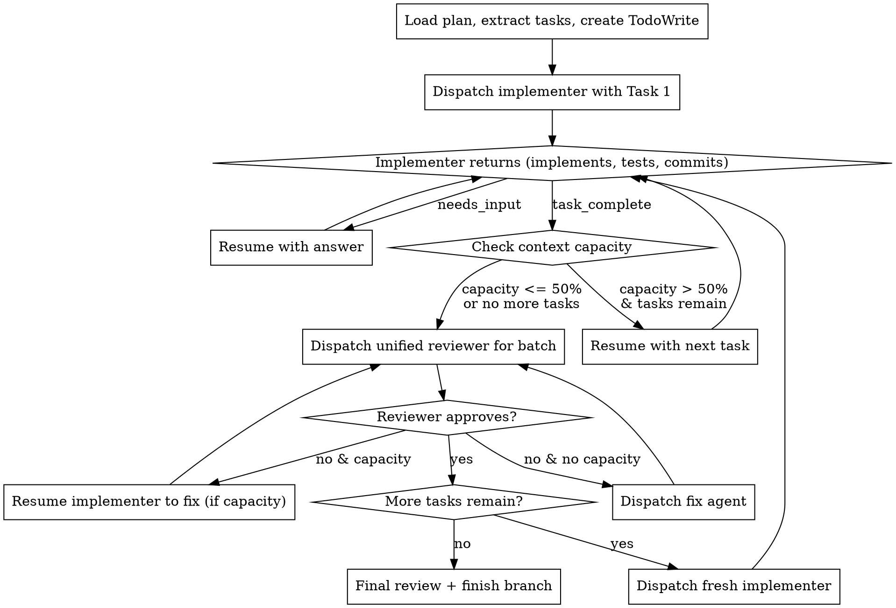

# Go Time

Time to make it real.

Execute plans by dispatching subagents that can be resumed for follow-up questions, reused across multiple tasks when context allows, and reviewed in batches.

**Core principles:**
- Resume > re-dispatch (preserve context for questions)
- Reuse agents while context is available
- Batch reviews after agent exhaustion (not per-task)
- One unified reviewer (spec + quality combined)

## When to Use

- You have an implementation plan with discrete tasks
- Tasks are mostly independent (can be done in sequence)
- You want efficient execution with minimal agent spawns

## The Process



## Agent Communication via Resume

**The key insight:** Task tool returns an `agent_id`. Use `resume: "<agent_id>"` to continue an agent with full context preserved.

### Handling Questions

```
1. Dispatch implementer with task
2. Implementer hits uncertainty, returns:
   {
     "status": "needs_input",
     "question": "Should auth tokens be stored in memory or Redis?",
     "context_so_far": "I've set up the auth middleware structure..."
   }
3. Task tool returns result + agent_id
4. You answer by resuming:
   Task tool with resume: "<agent_id>"
   prompt: "Answer: Use Redis for production, memory for tests. Continue."
5. Implementer continues with FULL prior context
```

### Context Capacity Reporting

Implementers self-report remaining capacity:

```
{
  "status": "task_complete",
  "context_capacity": "75%",  // estimated remaining context
  "summary": "Implemented auth middleware with Redis token storage",
  "files_changed": ["src/auth/middleware.ts", "src/auth/redis.ts"],
  "tests_passing": true
}
```

**Decision rule:**
- `>= 50%` capacity remaining → resume with next task
- `< 50%` capacity remaining → trigger review, then fresh agent

## Prompt Templates

### Dispatching Implementer

See `./implementer-prompt.md` for the full template. Key elements:

```
Task tool (general-purpose):
  description: "Implement: [task name]"
  prompt: |
    [Use template from ./implementer-prompt.md]

    Task: [FULL task text - don't make them read the plan file]
    Context: [Where this fits, dependencies, what came before]
```

### Resuming for Questions

```
Task tool:
  resume: "<agent_id from previous dispatch>"
  prompt: |
    Answer to your question: [your answer]

    [Any additional context they need]

    Continue with implementation.
```

### Resuming with Next Task

```
Task tool:
  resume: "<agent_id>"
  prompt: |
    Great work on the previous task.

    Next Task: [task name]

    [FULL task text]

    Context: [How this connects to what you just built]

    Same rules apply - ask if uncertain, report capacity when done.
```

### Dispatching Unified Reviewer

See `./unified-reviewer-prompt.md`. Reviews both spec compliance AND code quality in one pass.

```
Task tool (general-purpose):
  description: "Review Tasks N-M implementation"
  prompt: |
    [Use template from ./unified-reviewer-prompt.md]

    Tasks reviewed: [list]
    Expected behavior: [from plan]
    Files changed: [list from implementer reports]
    BASE_SHA: [commit before batch]
    HEAD_SHA: [current commit]
```

### Resuming Implementer for Fixes

If reviewer finds issues and implementer has capacity:

```
Task tool:
  resume: "<implementer_agent_id>"
  prompt: |
    The reviewer found issues with your implementation:

    [List issues from reviewer]

    Please fix these issues. When done, report as usual.
```

## Example Workflow

```
You: Using go-agents to execute this plan.

[Read plan, extract 6 tasks, create TodoWrite]

--- Agent 1: Tasks 1-3 ---

[Dispatch implementer with Task 1: Auth middleware]

Implementer returns:
{
  "status": "needs_input",
  "question": "The plan says 'standard auth flow' - do you mean OAuth2 or JWT?"
}

[Resume with answer]
You: "JWT with refresh tokens. The auth service at /api/auth handles token refresh."

Implementer returns:
{
  "status": "task_complete",
  "context_capacity": "80%",
  "summary": "Implemented JWT auth middleware",
  "files_changed": ["src/auth/jwt.ts", "src/middleware/auth.ts"],
  "tests_passing": true,
  "committed": "abc123f - Add JWT auth middleware with refresh token support"
}

[80% capacity - resume with Task 2]

Implementer returns:
{
  "status": "task_complete",
  "context_capacity": "55%",
  "committed": "def456a - Add user session management",
  ...
}

[55% - resume with Task 3]

Implementer returns:
{
  "status": "task_complete",
  "context_capacity": "30%",  // Below threshold
  "committed": "789bcd0 - Add rate limiting middleware",
  ...
}

[30% capacity - trigger review]

[Dispatch unified reviewer for Tasks 1-3]

Reviewer returns:
{
  "spec_compliance": "pass",
  "code_quality": {
    "status": "issues_found",
    "issues": [
      {"severity": "important", "issue": "Missing rate limiting on refresh endpoint"}
    ]
  }
}

[Implementer at 30% - dispatch fix agent instead of resuming]

[Fix agent addresses rate limiting]

[Re-review - passes]

[Mark Tasks 1-3 complete]

--- Agent 2: Tasks 4-6 ---

[Dispatch fresh implementer with Task 4]
...

--- Completion ---

[All tasks done, final review passes]

[Use finishing-a-development-branch skill]

Done!
```

## Advantages Over Traditional Approach

**vs. Fresh agent per task:**
- Fewer agent spawns (3-4 vs 6+ for 6 tasks)
- Context preserved across related tasks
- Agent builds understanding of the codebase

**vs. Reviews after every task:**
- Fewer review cycles (2 batch reviews vs 6 individual)
- Reviewer sees related changes together
- Can catch cross-task issues

**vs. Separate spec + quality reviews:**
- One reviewer pass instead of two
- Faster iteration
- Unified feedback

**Question handling via resume:**
- True context preservation (not re-explaining)
- Natural conversation flow
- Agent can ask follow-ups

## Red Flags

**Never:**
- Skip the unified review (even if implementer says "all good")
- Ignore capacity reports (don't force exhausted agents to continue)
- Make agents read the plan file (provide full task text)
- Rush past questions (answer thoroughly, they'll be resumed)
- Let implementers expand scope ("I also added X" = spec violation)
- **Dispatch multiple implementation subagents in parallel** (they will conflict on files)
- Let implementer self-review replace the unified review (both are needed)
- Skip scene-setting context (subagent needs to understand where task fits)

**If implementer expands scope:**
- They may be "helping" by implementing later tasks
- This causes conflicts and spec violations
- Resume with: "Please revert the extra changes. Only implement what's in your current task."

**If reviewer finds issues:**
- Resume original implementer if capacity allows (they have context)
- Otherwise dispatch fix agent with specific instructions
- Always re-review after fixes

**If subagent fails a task:**
- Don't try to fix manually (context pollution in your session)
- Dispatch a fix agent with specific instructions about what went wrong
- Give them the error output and clear guidance
- Or resume the original if they have capacity and just hit a fixable issue

## Integration

**Required input:**
- Implementation plan (from implementation-planning skill or similar)

**Works with:**
- `superpowers:finishing-a-development-branch` - After all tasks complete
- `superpowers:test-driven-development` - Implementers should follow TDD

**Replaces:**
- `superpowers:subagent-driven-development` - This is the enhanced version
- `superpowers:executing-plans` - This handles same-session execution better
