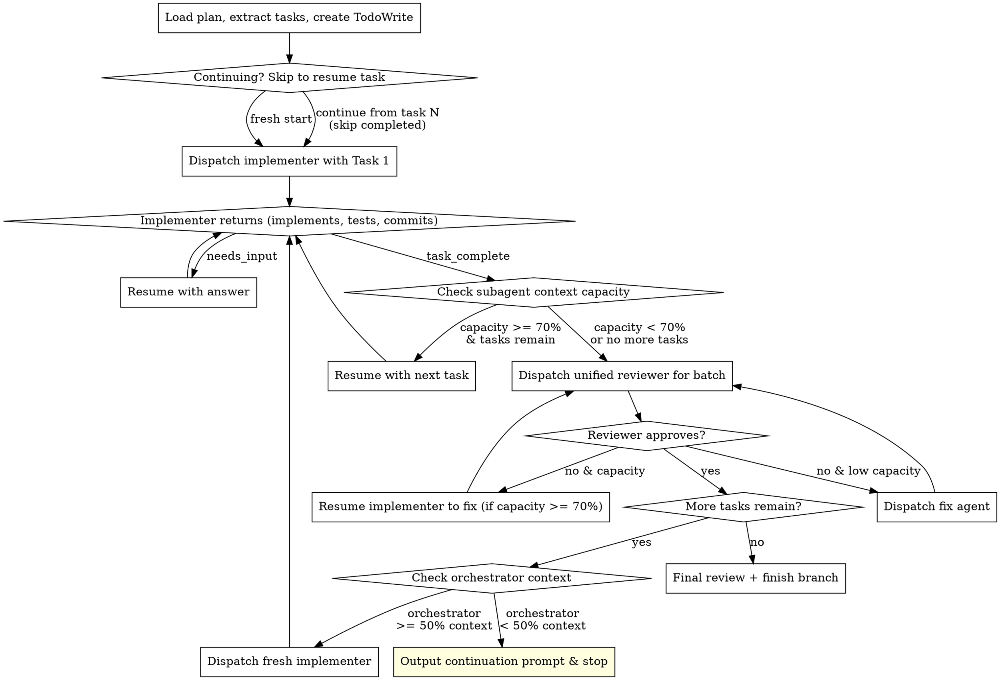

# Go Time

Time to make it real.

Execute plans by dispatching subagents that can be resumed for follow-up questions, reused across multiple tasks when context allows, and reviewed in batches.

**Core principles:**
- Resume only when subagent has plenty of context (>= 70%)
- Reuse agents while context is abundant, fresh agents when not
- Batch reviews after agent exhaustion (not per-task)
- One unified reviewer (spec + quality combined)
- Monitor your OWN context - hand off cleanly before exhaustion
- Implementers only run tests scoped to their changes; dispatch a test runner subagent for full suite periodically

## Your Role: Orchestrator Only

**You are the conductor, not the musicians.**

Your job is EXCLUSIVELY to:
- Read and understand the plan
- Extract tasks and create TodoWrite
- Dispatch implementer subagents
- Answer subagent questions (via resume)
- Monitor capacity and trigger reviews
- Dispatch reviewers and fix agents
- Track progress

**NEVER:**
- Implement tasks directly (context pollution)
- Write code yourself (dispatch a subagent)
- Fix issues yourself (dispatch a fix agent or resume implementer)
- "Help" by doing quick changes (still context pollution)

If you find yourself about to write code or make changes, STOP. Dispatch a subagent instead.

## When to Use

- You have an implementation plan with discrete tasks
- Tasks are mostly independent (can be done in sequence)
- You want efficient execution with minimal agent spawns
- Continuing a previous go-time session (user tells you which task/batch to resume from)

## Starting Fresh vs. Continuing

**Fresh start:** Load the plan, extract all tasks, create TodoWrite, begin from Task 1.

**Continuing from a previous session:** The user will tell you something like "continue from task 5" or "pick up at batch 3." When continuing:

1. Load the plan and extract all tasks as normal
2. Create TodoWrite but mark already-completed tasks as done (check git log / existing code)
3. Skip to the specified task and begin dispatching from there
4. Everything else works the same

The continuation prompt from the previous session tells you exactly where to pick up.

## Orchestrator Context Self-Monitoring

**You are not immune to context exhaustion.** After each batch review completes, honestly assess your own remaining context:

- How many batches have you orchestrated so far?
- How many subagent dispatches, resumes, and review cycles?
- How much task text and review output have you processed?

**If you estimate less than 50% of your own context remains**, do NOT start another batch. Instead, output a continuation prompt and stop:

```
---
## Continuation Prompt

Use go-time to continue executing the plan at: [plan file path]

**Resume from:** Task [N] ([task name])
**Completed so far:** Tasks 1-[M] (reviewed and approved)
**Current branch:** [branch name]
**Last commit:** [sha] - [message]
**Notes:** [Any context the next session needs - e.g., "Task 3 had a reviewer flag about X, keep an eye on that pattern"]
---
```

This is lightweight by design. The plan file has all the detail; the next session just needs to know where to pick up.

## The Process



## Agent Communication via Resume

**The key insight:** Task tool returns an `agent_id`. Use `resume: "<agent_id>"` to continue an agent with full context preserved.

### Handling Questions

```
1. Dispatch implementer with task
2. Implementer hits uncertainty, returns:
   {
     "status": "needs_input",
     "question": "Should auth tokens be stored in memory or Redis?",
     "context_so_far": "I've set up the auth middleware structure..."
   }
3. Task tool returns result + agent_id
4. You answer by resuming:
   Task tool with resume: "<agent_id>"
   prompt: "Answer: Use Redis for production, memory for tests. Continue."
5. Implementer continues with FULL prior context
```

### Context Capacity Reporting

Implementers self-report remaining capacity:

```
{
  "status": "task_complete",
  "context_capacity": "75%",  // estimated remaining context
  "summary": "Implemented auth middleware with Redis token storage",
  "files_changed": ["src/auth/middleware.ts", "src/auth/redis.ts"],
  "tests_passing": true
}
```

**Subagent decision rule (conservative - avoid wasting context on bad output):**
- `>= 70%` capacity remaining → resume with next task
- `< 70%` capacity remaining → trigger review, then fresh agent

**Orchestrator self-check (after each batch review completes):**
- `>= 50%` own context remaining → continue with next batch
- `< 50%` own context remaining → output continuation prompt and stop

## Prompt Templates

### Dispatching Implementer

See `./implementer-prompt.md` for the full template. Key elements:

```
Task tool (general-purpose):
  description: "Implement: [task name]"
  prompt: |
    [Use template from ./implementer-prompt.md]

    Task: [FULL task text - don't make them read the plan file]
    Context: [Where this fits, dependencies, what came before]
```

### Resuming for Questions

```
Task tool:
  resume: "<agent_id from previous dispatch>"
  prompt: |
    Answer to your question: [your answer]

    [Any additional context they need]

    Continue with implementation.
```

### Resuming with Next Task

```
Task tool:
  resume: "<agent_id>"
  prompt: |
    Great work on the previous task.

    Next Task: [task name]

    [FULL task text]

    Context: [How this connects to what you just built]

    Same rules apply - ask if uncertain, report capacity when done.
```

### Dispatching Unified Reviewer

See `./unified-reviewer-prompt.md`. Reviews both spec compliance AND code quality in one pass.

```
Task tool (general-purpose):
  description: "Review Tasks N-M implementation"
  prompt: |
    [Use template from ./unified-reviewer-prompt.md]

    Tasks reviewed: [list]
    Expected behavior: [from plan]
    Files changed: [list from implementer reports]
    BASE_SHA: [commit before batch]
    HEAD_SHA: [current commit]
```

### Resuming Implementer for Fixes

If reviewer finds issues and implementer has capacity (>= 70%):

```
Task tool:
  resume: "<implementer_agent_id>"
  prompt: |
    The reviewer found issues with your implementation.

    **Blocking issues (must fix):**
    [List critical/important issues from reviewer]

    **Quality improvements to incorporate:**
    [List ALL other feedback - SOLID, DRY, idioms, minor issues]

    Your job: Fix all blocking issues AND incorporate as many quality
    improvements as reasonable. We want clean, efficient, SOLID, DRY,
    elegant code - not just "working" code.

    When done, report as usual.
```

**Important:** Pass ALL review feedback to the implementer, not just blocking issues. The goal is clean, maintainable code. Minor improvements compound into significant quality gains.

## Example Workflow

```
You: Using go-time to execute this plan.

[Read plan, extract 6 tasks, create TodoWrite]

--- Agent 1: Tasks 1-2 ---

[Dispatch implementer with Task 1: Auth middleware]

Implementer returns:
{
  "status": "needs_input",
  "question": "The plan says 'standard auth flow' - do you mean OAuth2 or JWT?"
}

[Resume with answer]
You: "JWT with refresh tokens. The auth service at /api/auth handles token refresh."

Implementer returns:
{
  "status": "task_complete",
  "context_capacity": "75%",
  "summary": "Implemented JWT auth middleware",
  "files_changed": ["src/auth/jwt.ts", "src/middleware/auth.ts"],
  "tests_passing": true,
  "committed": "abc123f - Add JWT auth middleware with refresh token support"
}

[75% capacity >= 70% threshold - resume with Task 2]

Implementer returns:
{
  "status": "task_complete",
  "context_capacity": "55%",  // Below 70% threshold
  "committed": "def456a - Add user session management",
  ...
}

[55% < 70% - trigger review, do NOT resume with another task]

[Dispatch unified reviewer for Tasks 1-2]

Reviewer returns: { "overall": { "verdict": "approved" } }

[Mark Tasks 1-2 complete]

[Check own orchestrator context - still good, continue]

--- Agent 2: Tasks 3-4 ---

[Dispatch fresh implementer with Task 3]

Implementer returns:
{
  "status": "task_complete",
  "context_capacity": "60%",  // Below 70%
  "committed": "789bcd0 - Add rate limiting middleware",
  ...
}

[60% < 70% - trigger review after just 1 task, that's fine]

[Dispatch unified reviewer for Task 3]

Reviewer returns: { "overall": { "verdict": "needs_fixes", ... } }

[Implementer at 60% - below 70%, dispatch fix agent instead of resuming]

[Fix agent addresses issues, re-review passes]

[Dispatch fresh implementer with Task 4, completes at 65%, review passes]

[Mark Tasks 3-4 complete]

[Check own orchestrator context - estimate ~45% remaining, below 50%]

--- Orchestrator Context Low - Hand Off ---

Output:
---
## Continuation Prompt

Use go-time to continue executing the plan at: docs/plans/auth-system.md

**Resume from:** Task 5 (API rate limiting)
**Completed so far:** Tasks 1-4 (reviewed and approved)
**Current branch:** feature/auth-system
**Last commit:** aaa111b - Fix rate limiting per reviewer feedback
**Notes:** Reviewer flagged token validation duplication in batch 1 -
was fixed but watch for the pattern recurring in remaining tasks.
---

[Stop - do not start another batch]
```

### Example: Continuing a Previous Session

```
User: "Use go-time to continue the auth plan from task 5"

[Read plan, extract all 6 tasks]
[Create TodoWrite, mark tasks 1-4 as already completed]
[Start dispatching from Task 5]
[Everything else proceeds normally]
```

## Advantages Over Traditional Approach

**Conservative resume (70% threshold):**
- Agents only get more work when they have plenty of room
- Avoids degraded output from context-cramped agents
- Fresh agents are cheap; bad output from exhausted agents is expensive

**Orchestrator self-monitoring:**
- Session can span multiple batches without running out of orchestrator context
- Clean handoff to next session when context gets low
- No lost progress - continuation prompt tells next session exactly where to pick up

**Batched reviews:**
- Fewer review cycles than per-task reviews
- Reviewer sees related changes together
- Can catch cross-task issues

**Scoped test runs + periodic full suite:**
- Implementers only run tests directly related to their changes (fast feedback, no waiting on slow suites)
- After every 2-3 batch reviews, dispatch a dedicated test runner subagent to run the full test suite
- If the test runner finds regressions, dispatch a fix agent with the failure output
- This keeps implementers fast while still catching cross-task breakage

**Question handling via resume:**
- True context preservation (not re-explaining)
- Natural conversation flow
- Agent can ask follow-ups

## Red Flags

**Never:**
- Skip the unified review (even if implementer says "all good")
- Ignore capacity reports (don't force exhausted agents to continue)
- Make agents read the plan file (provide full task text)
- Rush past questions (answer thoroughly, they'll be resumed)
- Let implementers expand scope ("I also added X" = spec violation)
- **Dispatch multiple implementation subagents in parallel** (they will conflict on files)
- Let implementer self-review replace the unified review (both are needed)
- Skip scene-setting context (subagent needs to understand where task fits)

**If implementer expands scope:**
- They may be "helping" by implementing later tasks
- This causes conflicts and spec violations
- Resume with: "Please revert the extra changes. Only implement what's in your current task."

**If reviewer finds issues:**
- Resume original implementer ONLY if capacity >= 70% (they have context AND room)
- Otherwise dispatch a fresh fix agent with specific instructions
- Always re-review after fixes

**If subagent fails a task:**
- NEVER try to fix manually - this pollutes YOUR context and defeats the entire purpose of orchestration
- Dispatch a fix agent with specific instructions about what went wrong
- Give them the error output and clear guidance
- Only resume the original if they have >= 70% capacity AND just hit a fixable issue
- Remember: you are the orchestrator, not the implementer

**If YOUR orchestrator context is getting low:**
- Don't try to squeeze in "just one more batch"
- Output the continuation prompt and stop cleanly
- The next session picks up with full context - that's the whole point

## Integration

**Required input:**
- Implementation plan (from implementation-planning skill or similar)

**Works with:**
- `superpowers:finishing-a-development-branch` - After all tasks complete
- `superpowers:test-driven-development` - Implementers should follow TDD

**Replaces:**
- `superpowers:subagent-driven-development` - This is the enhanced version
- `superpowers:executing-plans` - This handles same-session execution better
