# Complete Workflow Diagram

This diagram shows the entire process from initial brainstorming through to execution.

```mermaid
flowchart TD
    Start([New Feature Request]) --> DreamFirst[/dream-first/]

    %% Brainstorming Phase
    DreamFirst --> Phase1[Phase 1: Understand Goal]
    Phase1 --> Phase2[Phase 2: Explore Options]
    Phase2 --> Phase3[Phase 3: Make Decisions]
    Phase3 --> Phase4[Phase 4: Define Scope]
    Phase4 --> Phase5[Phase 5: Write Gherkin Stories]
    Phase5 --> Phase6[Phase 6: Write Design Doc]
    Phase6 --> DesignReview{{Design Review<br/>Opus Subagent}}

    DesignReview -->|Gaps Found| Phase8[Incorporate Feedback]
    Phase8 --> DesignReview
    DesignReview -->|Approved| DesignDoc[(Design Document)]

    %% Plan from Design
    DesignDoc --> PlanCmd[/blueprint/]
    PlanCmd --> Assess{Assess Complexity}

    %% Simple Path
    Assess -->|< 5-7 Simple Tasks| Simple[blueprint skill]
    Simple --> SimpleOutline[Create Task Outline]
    SimpleOutline --> SimpleGap{{Gap Analysis<br/>Opus Subagent}}
    SimpleGap -->|Gaps Found| SimpleOutline
    SimpleGap -->|No Gaps| SimpleDetail[Write Detailed Plan]
    SimpleDetail --> SimpleFinal{{Final Review<br/>Opus Subagent}}
    SimpleFinal -->|Issues| SimpleDetail
    SimpleFinal -->|Approved| PlanDoc

    %% Complex Path - Story Time
    Assess -->|8+ Tasks or Complex| StoryTime[story-time]
    StoryTime --> STOutline[Task Outline Agent]
    STOutline --> STGap{{Gap Analysis<br/>Opus Subagent}}
    STGap -->|Gaps Found| STFix[Fresh Fix Agent]
    STFix --> STGap
    STGap -->|Gap-Free| ValidatedOutline[(Validated Outline)]

    %% Complex Path - Blueprint Maestro
    ValidatedOutline --> Maestro[blueprint-maestro]
    Maestro --> ResumeCheck{Resume or<br/>Fresh Start?}
    ResumeCheck -->|Fresh| BatchStart
    ResumeCheck -->|Resume| BatchStart

    %% Batch Loop
    BatchStart{More Tasks?} -->|Yes| BatchWriter[Fresh Writer Agent<br/>2-3 Tasks]
    BatchWriter --> BatchReview{{Batch Reviewer<br/>Opus Subagent}}
    BatchReview -->|Issues Found| FixAgent[Fresh Fix Agent]
    FixAgent --> BatchReview
    BatchReview -->|Approved| ContextCheck{Context<br/>< 70%?}
    ContextCheck -->|Yes| BatchStart
    ContextCheck -->|No| Handoff[Write Handoff<br/>Resume Later]

    BatchStart -->|All Complete| FinalReview{{Final Plan Review<br/>Opus Subagent}}
    FinalReview -->|Issues| FeedbackFix[Fresh Fix Agent]
    FeedbackFix --> FinalReview
    FinalReview -->|Approved| PlanDoc[(Implementation Plan)]

    %% Execution
    PlanDoc --> GoTimeCmd[/go-time/]
    GoTimeCmd --> GoTime[go-time skill]
    GoTime --> Impl[Implementers]
    Impl --> UnifiedReview{{Unified Review<br/>Spec + Code Quality}}
    UnifiedReview -->|Iterate| Impl
    UnifiedReview -->|Bugs| PatchParty[/patch-party/]
    UnifiedReview -->|Clean| Done([Feature Complete!])

    PatchParty --> Triage[Triage]
    Triage --> BugFix[Fix Subagents]
    BugFix -->|2 Fails| RubberDuck[/rubber-duck/]
    RubberDuck --> BugFix
    BugFix -->|Design Gap| DreamFirst
    BugFix -->|Fixed| BugsDoc[(bugs.md)]
    BugsDoc -->|More| Triage
    BugsDoc -->|Done| Done

    %% Styling
    classDef reviewNode fill:#ff6b6b,stroke:#c92a2a,color:#fff
    classDef agentNode fill:#4dabf7,stroke:#1971c2,color:#fff
    classDef docNode fill:#51cf66,stroke:#2f9e44,color:#fff
    classDef cmdNode fill:#ffd43b,stroke:#f59f00,color:#000

    class DesignReview,SimpleGap,SimpleFinal,STGap,BatchReview,FinalReview,UnifiedReview reviewNode
    class Phase1,Phase2,Phase3,Phase4,Phase5,Phase6,SimpleOutline,SimpleDetail,STOutline,STFix,BatchWriter,FixAgent,FeedbackFix,Impl agentNode
    class DesignDoc,ValidatedOutline,PlanDoc,BugsDoc docNode
    class DreamFirst,PlanCmd,Simple,StoryTime,Maestro,GoTimeCmd,GoTime,PatchParty,RubberDuck cmdNode
```



## Legend

- **Yellow Boxes** - Skills/Commands you invoke
- **Blue Boxes** - Agent actions (task creation, writing, fixing)
- **Red Diamonds** - Review stages (Opus subagents)
- **Green Cylinders** - Documents produced
- **Gray Diamonds** - Decision points

## Key Review Stages

1. **Design Review** - Validates design before planning (dream-first)
2. **Gap Analysis** - Finds structural gaps in task outline (story-time)
3. **Batch Reviews** - Incremental quality checks per batch (blueprint-maestro)
4. **Final Plan Review** - Verifies complete plan executability (blueprint-maestro)
5. **Unified Review** - Checks spec compliance + code quality (go-time)

## Workflow Paths

**Simple Feature (< 5-7 tasks):**
```
dream-first → blueprint → go-time
```

**Complex Feature (8+ tasks):**
```
dream-first → story-time → blueprint-maestro → go-time
```

## Agent Patterns

- **story-time:** Fresh fix agents for gap repairs (no resumed agents)
- **blueprint-maestro:** Fresh writer per batch, fresh fix agents for repairs, context checkpoints with handoff
- **go-time:** Resume same agent while context allows (efficient reuse)
- **Reviews:** Always fresh Opus subagents (unbiased perspective)
