# Complete Workflow Diagram

This diagram shows the entire process from initial brainstorming through to execution.

```mermaid
flowchart TD
    Start([New Feature Request]) --> Brainstorm[/brainstorming-to-plan/]

    %% Brainstorming Phase
    Brainstorm --> Phase1[Phase 1: Understand Goal]
    Phase1 --> Phase2[Phase 2: Explore Options]
    Phase2 --> Phase3[Phase 3: Make Decisions]
    Phase3 --> Phase4[Phase 4: Define Scope]
    Phase4 --> Phase5[Phase 5: Write Gherkin Stories]
    Phase5 --> Phase6[Phase 6: Write Design Doc]
    Phase6 --> DesignReview{{Design Review<br/>Opus Subagent}}

    DesignReview -->|Gaps Found| Phase8[Phase 8: Incorporate Feedback]
    Phase8 --> DesignReview
    DesignReview -->|Approved| DesignDoc[(Design Document)]

    %% Plan from Design
    DesignDoc --> PlanCmd[/plan-from-design/]
    PlanCmd --> Assess{Assess Complexity}

    %% Simple Path
    Assess -->|< 5-7 Simple Tasks| Simple[/implementation-planning/]
    Simple --> SimpleOutline[Create Task Outline]
    SimpleOutline --> SimpleGap{{Gap Analysis<br/>Opus Subagent}}
    SimpleGap -->|Gaps Found| SimpleOutline
    SimpleGap -->|No Gaps| SimpleDetail[Write Detailed Plan]
    SimpleDetail --> SimpleFinal{{Final Review<br/>Opus Subagent}}
    SimpleFinal -->|Issues| SimpleDetail
    SimpleFinal -->|Approved| PlanDoc

    %% Orchestrator Path
    Assess -->|8+ Tasks or Complex| Orch[/implementation-planning-orchestrator/]
    Orch --> OrcPhase1[Phase 1: Read Design]
    OrcPhase1 --> OrcPhase2[Phase 2: Task Outline Agent]
    OrcPhase2 --> OrcPhase3{{Phase 3: Gap Analysis Agent}}

    OrcPhase3 -->|Critical/Important Gaps| Resume1[Resume Outline Agent]
    Resume1 --> OrcPhase3
    OrcPhase3 -->|Gap-Free| OrcPhase4[Phase 4: Batched Planning]

    %% Batch Loop
    OrcPhase4 --> BatchStart{More Tasks?}
    BatchStart -->|Yes| BatchWriter[Batch Writer Agent<br/>Tasks N-M]
    BatchWriter --> BatchReview{{Batch Reviewer Agent<br/>Tasks N-M}}
    BatchReview -->|Issues Found| ResumeWriter[Resume Writer Agent]
    ResumeWriter --> BatchReview
    BatchReview -->|Approved| BatchStart

    BatchStart -->|All Complete| OrcPhase5{{Phase 5: Final Plan Review<br/>Opus Subagent}}
    OrcPhase5 -->|Issues| OrcPhase6[Phase 6: Feedback Agent]
    OrcPhase6 --> OrcPhase5
    OrcPhase5 -->|Approved| PlanDoc[(Implementation Plan)]

    %% Execution
    PlanDoc --> ExecCmd[/execute-plan/]
    ExecCmd --> GoAgents[/go-agents/]
    GoAgents --> ExtractTasks[Extract All Tasks]
    ExtractTasks --> CreateTodos[Create TodoWrite]
    CreateTodos --> ImplLoop{More Tasks?}

    ImplLoop -->|Yes| Implementer[Implementer Agent<br/>Tasks 1-N]
    Implementer --> CheckContext{Context < 50%?}
    CheckContext -->|Yes| ResumeImpl[Resume with More Tasks]
    ResumeImpl --> Implementer
    CheckContext -->|No| Review{{Unified Reviewer<br/>Spec + Code Quality}}
    Review -->|Fixes Needed| ResumeImpl2[Resume Implementer]
    ResumeImpl2 --> Review
    Review -->|Approved| ImplLoop

    ImplLoop -->|All Complete| Finish[/finishing-a-development-branch/]
    Finish --> Done([Feature Complete!])

    %% Styling
    classDef reviewNode fill:#ff6b6b,stroke:#c92a2a,color:#fff
    classDef agentNode fill:#4dabf7,stroke:#1971c2,color:#fff
    classDef docNode fill:#51cf66,stroke:#2f9e44,color:#fff
    classDef cmdNode fill:#ffd43b,stroke:#f59f00,color:#000

    class DesignReview,SimpleGap,SimpleFinal,OrcPhase3,BatchReview,OrcPhase5,Review reviewNode
    class Phase1,Phase2,Phase3,Phase4,Phase5,Phase6,SimpleOutline,SimpleDetail,OrcPhase2,BatchWriter,Implementer agentNode
    class DesignDoc,PlanDoc docNode
    class Brainstorm,PlanCmd,ExecCmd,Simple,Orch,GoAgents,Finish cmdNode
```



## Legend

- **Yellow Boxes** - Skills/Commands you invoke
- **Blue Boxes** - Agent actions (task creation, writing)
- **Red Diamonds** - Review stages (Opus subagents)
- **Green Cylinders** - Documents produced
- **Gray Diamonds** - Decision points

## Key Review Stages

1. **Design Review** - Validates design before planning (brainstorming)
2. **Gap Analysis** - Finds structural gaps in task outline (planning)
3. **Batch Reviews** - Incremental quality checks per batch (orchestrator only)
4. **Final Plan Review** - Verifies complete plan executability (planning)
5. **Unified Review** - Checks spec compliance + code quality (execution)

## Workflow Paths

**Simple Feature (< 5-7 tasks):**
```
brainstorming-to-plan → plan-from-design → implementation-planning → execute-plan
```

**Complex Feature (8+ tasks):**
```
brainstorming-to-plan → plan-from-design → implementation-planning-orchestrator → execute-plan
```

## Agent Reuse Pattern

- **Orchestrator:** Fresh agent per batch (avoid context limits)
- **Go-agents:** Resume same agent while context allows (efficient reuse)
- **Reviews:** Always fresh Opus subagents (unbiased perspective)
